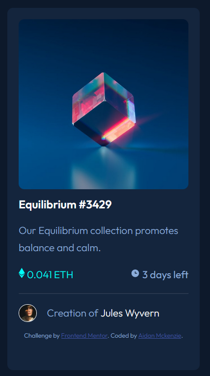

# Frontend Mentor - NFT preview card component solution

This is a solution to the [NFT preview card component challenge on Frontend Mentor](https://www.frontendmentor.io/challenges/nft-preview-card-component-SbdUL_w0U). Frontend Mentor challenges help you improve your coding skills by building realistic projects. 

## Table of contents

- [Overview](#overview)
  - [The challenge](#the-challenge)
  - [Screenshot](#screenshot)
  - [Links](#links)
- [My process](#my-process)
  - [Built with](#built-with)
  - [What I learned](#what-i-learned)
  - [Continued development](#continued-development)
- [Author](#author)

## Overview

### The challenge

Users should be able to:

- View the optimal layout depending on their device's screen size
- See hover states for interactive elements

### Screenshot



### Links

- Solution URL: [Add solution URL here](https://mckensis.github.io/nft-preview-card-component/index.html)
- Live Site URL: [Add live site URL here](https://mckensis.github.io/)

## My process

### Built with

- Semantic HTML5 markup
- CSS custom properties
- CSS variables & classes
- Flexbox
- Mobile-first workflow

### What I learned

I created a div using the HTML below to contain the Equilibruim image, which I was then able to overlay with a second image using the CSS below

```html
<div class="imageContainer">

</div>
```

```css
.imageContainer:hover {
  background: url("./images/icon-view.svg") no-repeat center;
  color: white;
  background-color: rgb(0, 255, 255, 60%);
}
```

### Continued development

I will continue completing these Frontend Mentor challenges. This was the first time I used custom variables, hover states, and a mobile-first workflow, which I would like to continue developing knowledge on.

## Author

- Website - [Aidan Mckenzie](https://mckensis.github.io/)
- Frontend Mentor - [@mckensis](https://www.frontendmentor.io/profile/mckensis)
- Github - [@mckensis](https://github.com/mckensis)
